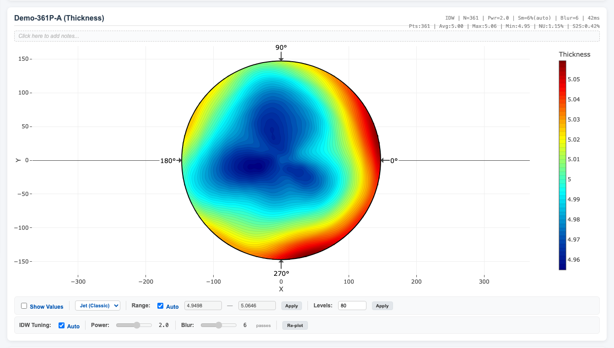
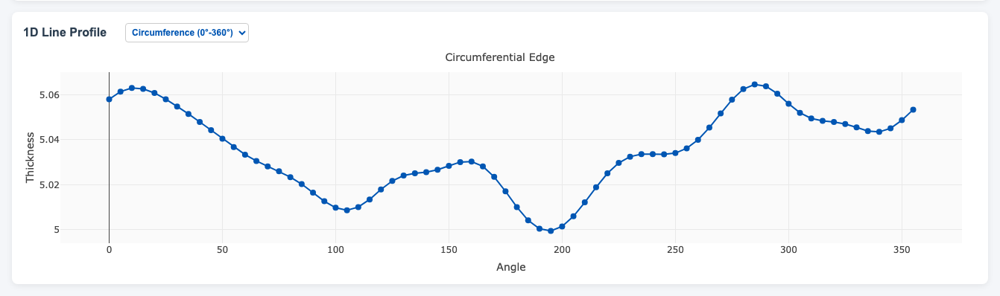

# Wafer Mapper

[中文说明](./README.zh-CN.md)

Wafer Mapper is a lightweight browser-based visualization tool for wafer thickness and profile data. It is currently a pure static frontend project with no build step, so you can open it directly in a browser and start using it.

The tool converts discrete measurement points into a 2D contour map and a 1D profile view, making it useful for quick wafer profile checks, `W2 - W1` delta comparison, and basic uniformity analysis.

## Screenshots

The examples below are generated from the sanitized demo dataset included in this repository.

### 2D Thickness Map



### 1D Circumferential Line Profile



## Features

- Built-in coordinate presets for `49P` and `361P`
- Single-wafer thickness mapping
- Dual-wafer delta mapping using `W2 - W1`
- Basic statistics:
  - `Avg`
  - `Max`
  - `Min`
  - `NU%` (Non-Uniformity)
  - `S2S%` (plane-fit / slope-related metric)
- 2D contour visualization using `IDW` interpolation
- Gaussian blur post-processing for smoother maps
- 1D line profiles:
  - `Horizontal (Y≈0)`
  - `Vertical (X≈0)`
  - `Circumference (0°-360°)`
- Local saving of commonly used THK datasets
- JSON import/export for backup and transfer
- History cards with notes

## Main UI

The current entry file is [`index.html`](./index.html).

### Left Panel

- `XY Coord Pattern`
  - Selects the measurement coordinate preset
  - Currently supports `49P` and `361P`
- `Wafer 1 THK`
  - Input or load the first wafer thickness dataset
- `Wafer 2 THK`
  - Optional
  - If provided, the tool will generate `W2 - W1`
- `Generate Maps`
  - Builds the 2D map and the 1D profile chart

### Right Panel

- `2D Contour Map`
  - Displays the interpolated wafer map
  - Supports colorscale switching, contour density, value labels, and manual range control
- `IDW Tuning`
  - Allows automatic or manual control of interpolation power and blur passes
- `Wafer Statistics`
  - Shows current and historical entries
  - Clicking a history card restores the corresponding map
- `1D Line Profile`
  - Shows a profile slice through the wafer

## Input Format

### Thickness Data

Thickness input should be one numeric value per line, for example:

```text
5.1200
5.0830
5.0975
5.1012
...
```

Rules:

- `49P` mode requires 49 values
- `361P` mode requires 361 values
- Empty or non-numeric lines are ignored
- If `Wafer 2 THK` is provided, its length must match `Wafer 1 THK`

### Coordinate Presets

Coordinate presets are defined in [`coords.js`](./coords.js). The current built-in presets are:

- `49P`
- `361P`

To add a new pattern later, you only need to add another coordinate block to `rawCoords`. The parser automatically converts it into a `COORD_PRESETS` entry.

## Modes and Statistics

### Single-Wafer Mode

If only `Wafer 1 THK` is provided, the tool renders a thickness map for that wafer.

Statistics:

- `Avg`: average value
- `Max`: maximum value
- `Min`: minimum value
- `NU%`: `((Max - Min) / (2 * Avg)) * 100`
- `S2S%`: a slope-related metric derived from a plane-fit calculation

### Delta Mode

If both `Wafer 1 THK` and `Wafer 2 THK` are provided, the tool generates:

```text
Delta = W2 - W1
```

In delta mode:

- A diverging colorscale is used
- The map label becomes `Delta (W2-W1)`
- `NU%` and `S2S%` are shown as `N/A`

## Visualization and Algorithm Notes

### 2D Interpolation

The tool uses `IDW` (Inverse Distance Weighting) to interpolate discrete measurement points onto a regular grid and render a contour map.

Main controls:

- `Power`
  - Controls how strongly nearby points dominate the interpolation
  - Higher values make the map more local and sharper
- `Blur`
  - Applies Gaussian blur after interpolation
  - Helps reduce spikes and visual roughness

The default `Auto` mode adjusts parameters based on point count:

- `49P` is tuned to be smoother and more global
- `361P` is tuned to preserve more local detail, with stronger blur compensation

### 1D Profiles

Three profile modes are available:

- `Horizontal (Y≈0)`: points near the horizontal center line
- `Vertical (X≈0)`: points near the vertical center line
- `Circumference (0°-360°)`: edge points sorted by angle

### Display Controls

The contour panel supports:

- Colorscale switching
- Automatic or manual z-range control
- Contour level adjustment
- Value label toggle for raw measurement points

## Local Storage and Backups

The app stores part of its data in browser `localStorage`.

Current keys include:

- `wafer_app_thk`
- `wafer_app_notes`

This means:

- Data persists when you refresh the page under the same browser and origin
- `file://` and `http://localhost:xxxx` do not share the same storage
- Different ports such as `8765` and `8766` are treated as different origins

### Export

Click `Export Backup` to download a JSON backup file. The repository includes a sanitized demo backup in [`wafer_data_backup.json`](./wafer_data_backup.json).

### Import

Click `Import Data` and choose a backup JSON file to restore:

- Saved THK datasets
- History entries
- Notes

## Running Locally

### Option 1: Open the HTML File Directly

Open [`index.html`](./index.html) in a browser.

Good for:

- Quick checks
- Personal offline use

### Option 2: Run Through localhost

Using a local HTTP server is recommended when you want cleaner browser-origin separation, easier testing, or future GitHub Pages deployment.

```bash
cd "Wafer-Mapper"
python3 -m http.server 8766
```

Then open:

```text
http://localhost:8766/
```

## Project Structure

```text
Wafer-Mapper/
├── docs/
│   └── images/
│       ├── demo-361p-line-profile.png
│       └── demo-361p-thickness.png
├── index.html             # Main page: UI, statistics, plotting logic
├── coords.js              # Coordinate preset database and parser
├── wafer_data_backup.json # Sanitized demo backup data
├── README.md              # English project documentation
├── README.zh-CN.md        # Chinese project documentation
├── scripts/
│   └── generate_readme_screenshots.js
└── LICENSE                # MIT license
```

## Tech Stack

- Native `HTML`
- Native `CSS`
- Native `JavaScript`
- [Plotly.js](https://plotly.com/javascript/) for 2D and 1D plotting

Notes:

- Plotly is loaded from CDN
- If your network environment cannot access the CDN, plotting will not load correctly

## Current Limitations

- Most logic is still concentrated in a single HTML file
- Some UI rendering still relies on `innerHTML`, which should be hardened if the project is distributed more broadly
- The main entry file is now `index.html`, which is cleaner for direct hosting and GitHub Pages deployment
- There are no automated tests yet
- The UI is primarily optimized for desktop usage

## Possible Next Steps

- Split plotting and data logic into separate JavaScript modules
- Add more coordinate presets such as `137P`
- Add CSV / TSV import
- Add image export or snapshot export
- Add a one-click clear-local-data action
- Convert the project into a cleaner GitHub Pages structure

## Privacy and Demo Data

The repository version of [`wafer_data_backup.json`](./wafer_data_backup.json) has been sanitized:

- No real wafer IDs
- No real production thickness data
- Only demo-compatible point counts and example distributions are preserved

If you plan to keep this repository public, it is best to continue avoiding:

- Real production samples
- Customer information
- Internal company identifiers

## License

MIT. See [`LICENSE`](./LICENSE).
